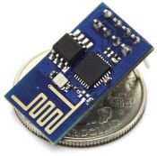
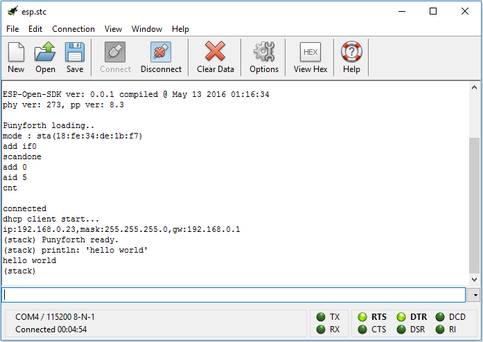

[](https://travis-ci.org/zeroflag/punyforth)

# Punyforth



Punyforth is a simple, stack-based, [Forth](https://en.wikipedia.org/wiki/Forth_(programming_language)) inspired programming language that primarily targets Internet of Things (IOT) devices, like the [ESP8266](https://en.wikipedia.org/wiki/ESP8266). The ESP8266 is a low-cost Wi-Fi capable chip with a 80 MHz Xtensa LX3 32 bit CPU, TCP/IP stack, GPIO pins and 512 KiB to 4 MiB flash memory. It is widely used in IoT applications and home automation projects.

Punyforth also runs on x86 (Linux), ARM (Raspberry PI) but these are *not* the primary supported targets.

## Design goals

* Simple
* Highly interactive
* Extensible
* Small memory footprint and resource efficiency

## Quick start

The easiest way to try out Punyforth is to use a ESP8266 based development board that has USB to serial interface on board (Geekcreit/Doit, Amica, WeMos, LoLin). Connect the development board to your computer via USB. Let's assume the serial port is COM4.

```bash
$ cd arch/esp8266/bin
$ python flash.py COM4
```

The flash.py utility will store the Punyforth binary and modules source code on the flash memory of the esp8266.

Open a serial terminal<sup>[1](#serial)</sup> on port COM4 then type:

```forth
println: "Hello world!"
```



<a name="serial">1</a>: Baud rate: 115200 bps. Local echo: on, line mode: enabled. You can find some free terminal emulators [here](https://learn.sparkfun.com/tutorials/terminal-basics/all).

Note that flash.py flashes with Quad I/O speed (qio) by default. This is the fastest mode but not all devices support this. If you have trouble while flashing try adding a --flashmode dio parameter.

##### Now let's do some simple arithmetics.

```forth
4
dup
+
.
```

This should give you the following output.

```lisp
(stack)
(stack 4)
(stack 4 4)
(stack 8)
(stack)
8
```
Congratulation, you've just doubled a number and printed out the result in the [REPL](https://en.wikipedia.org/wiki/Read%E2%80%93eval%E2%80%93print_loop).

For a detailed getting started guide see [Developing and deploying Punyforth applications](https://github.com/zeroflag/punyforth/wiki/Developing-and-deploying-Punyforth-applications).

## About the language

Punyforth is a simple, imperative, stack-based, [concatenative programming language](https://en.wikipedia.org/wiki/Concatenative_programming_language) and interactive environment with good metaprogramming support and extensibility.

The Forth environment combines the compiler with an interactive shell (REPL), where the user can define functions called words.

Punyforth does not have local variables, instead values are kept on a stack. This stack is used only for storing data. There is a separate return stack that stores information about nested subroutine calls. Both stacks are first-class in the language.

As a consequence of the stack, Punyforth uses a form of syntax known as [Reverse Polish or Postfix Notation](https://en.wikipedia.org/wiki/Reverse_Polish_notation).

If you type the following code in the REPL:

```forth

1 2 +

```

The interpreter pushes the number 1 then the number 2 onto the data stack. It executes the word *+*, which pops the two top level items off the stack, calculates their sum, and pushes the result back to the stack.

The following code calculates *a * a + b * b*.

```forth
2 3                  \ let's say a is 2, b is 3
dup * swap dup * + . \ prints out 13
```

The word *dup* duplicates the top level item of the stack. The word *swap* exchanges the two top level items of the stack.

Stack visualization:
<pre>
2 3  3  9  2   2 4 13
  2  3  2  9   2 9
     2         9
</pre>

*dup* and *swap* are [stack shuffle](http://wiki.laptop.org/go/Forth_stack_operators) words. Excessive use of words like them makes the code hard to follow, so it is advisable to use them sparingly. There are many ways to reduce the number of stack shuffles, one of them is to use [quotations and combinators](http://elasticdog.com/2008/12/beginning-factor-shufflers-and-combinators/).

For example the above code could have been expressed the following way:

```forth
2 3 { square } bi@ +
```

Where square is defined as _dup *_.

See the chapter about quotations and combinators for more information.

### Differences between Punyforth and other Forth systems

Punyforth is heavily inspired by the [Forth](https://en.wikipedia.org/wiki/Forth_(programming_language)) programming language. It uses the same compilation model (outer interpreter, compiler, modes, dictionary, immediate words, etc.) as other Forth systems. Punyforth is [bootstrapped](http://www.lispcast.com/two-kinds-of-bootstrapping) from a small set of [primitives](arch/x86/primitives.S) written in assembly language. The compiler targets these primitives and compiles [indirect-threaded code](https://en.wikipedia.org/wiki/Threaded_code). Higher level abstractions are built on top of the primitives therefore most of the system is written in itself (in Forth).

#### Some of the differences
* Punyforth is case sensitive
* Strings are null-terminated
* String literals ("Hello World") and character literals ($A) are supported
* Strings can be printed out differently (*print: "foobar"* instead of *." foobar"*)
* Parsing words are ended with a colon character by convention (including *variable:*, *constant:*, *create: does>*)
* Defining a word in terms of itself results recursion by default (use the *override* word to alter this behaviour)
* Curly brackets denote quotations instead of locals

Punyforth supports exception handling, multitasking, socket and GPIO APIs and comes with a UART and a TCP REPL.


### Programming

During programming, the user uses the REPL to write and test small piece of codes or to extend the languge with new words (which are called subroutines or functions in other languages).

The REPL (also known as the Forth Outer/Text Interpreter) operates in 2 modes. In interpretation mode, it immediately executes the words that the user typed in. In compilation mode (when you start a new word definition), its action depends on the compilation semantic of the current word. In most cases it compiles the execution token (pointer to the word) into the word to be defined. However, if the current word is flagged as immediate, the compiler executes the word at compile time so the word can define its own compilation semantic. This is a bit similar to Lisp macros. Control structures are implemented as immediate words in Forth.

### The syntax

Forth has almost no syntax. It grabs tokens separated by whitespace, looks them up in a dictionary then executes either their compilation or interpretation semantic. If the token is not found in the dictionary, it tries to convert it to a number. *Eeverything in Forth is either a word or a number*. Because of the postfix notation there are no precedence rules and parentheses.

```forth
 This is an example of
 valid   Forth syntax 123  *&^%$#@2
```

### Extending the dictionary

Words are stored in a *dictionary*. The dictionary maps words to executable code or data structures.

You can use *defining words* to extend the dictionary with new definitions. The most basic defining words is the *:* (colon). This adds a new word to the dictionary with the behavior defined in terms of existing words. A colon definition begins with a colon and ends with a semicolon.

```forth
: square ( n -- n^2 ) dup * ;

4 square .      \ prints 16
```

In the above example we created a new word called *square* that takes a number off the stack, multiplies it with itself, then leaves the result on the stack. The *( n -- n^2 )* is the optional stack effect comment indicating the input and output parameters.

Other common defining words are *variable:* and *constant:*.

```forth
variable: var1                \ create a variable 'var1' without initializing
54 init-variable: var2        \ create a variable 'var2' and initialize it to 54
42 constant: answer           \ create a constant 'answer' with the value 42

var2 @ var1 !   \ assigns the value of var2 to var1
var1 ?          \ prints out 54
answer .        \ prints out 42
```

### Control structures

Punyforth supports the regular Forth conditional and loop words.

#### Conditionals

General form of *if else then*.

```forth
<bool> if <consequent> else <alternative> then
```

For example:
```forth
: max ( a b -- max )
  2dup < if nip else drop then ;

10 100 max . \ prints 100
```

The else part can be omitted.

```forth
: abs ( n -- absn )
  dup 0< if -1 * then ;

-10 abs . \ prints 10
```

#### Case statement

Punyforth also supports switch-case like flow control logic as shown in the following example.

```forth
: day ( n -- )
  case
    1 of print: "Monday" endof
    2 of print: "Tuesday" endof
    3 of print: "Wednesday" endof
    4 of print: "Thursday" endof
    5 of print: "Friday" endof
    6 of print: "Saturday" endof
    7 of print: "Sunday" endof
    print: "Unknown day: " .
  endcase ;
````

#### Count-controlled loops

The *limit* and *start* before the word *do* defines the number of times the loop will run.

```forth
<limit> <start> do <loop-body> loop
```

*Do* loops iterate through integers by starting at *start* and incrementing until you reach the *limit*. The word *i* pushes the loop index onto the stack. In a nested loop, the inner loop may access the loop variable of the outer loop by using the word *j*.

For example:
```forth
5 0 do i . loop \ prints 01234
```

There is an other version of the *do* loop where you can define the increment (which can be negative as well).

```forth
<limit> <start> do <loop-body> <increment> +loop
```

For example:

```forth
10 0 do i . 2 +loop \ prints 02468
```

If the increment is negative then *limit* is inclusive.

```forth
0 8 do i . -2 +loop \ prints 86420
```

It is important to know that *Do* loops store the loop index on the return stack. You can break the semantics of *i* and *j* if you use the return stack to store temporary data. Also you can't simply *exit* a word from inside a do loop without clearing the return stack first. See *unloop* for more information.

#### Condition-controlled loops

##### until loop

```forth
begin <loop-body> <bool> until
```
The *begin*...*until* loop repeats until a condition is true. This loop always executes at least one time.

For example:

```forth
: countdown ( n -- )
  begin
    dup .
    1- dup
  0 < until
  drop ;

5 countdown \ prints 543210
```

If you replace *until* with *again* and omit the condition then the loop will run indefinitely.

```forth
begin <loop-body> again
```

##### while loop

```forth
begin .. <bool> while <loop-body> repeat
```
For example:
```forth
: countdown ( n -- )
  begin
    dup 0 >=
  while
    dup . 1-
  repeat
  drop ;

5 countdown \ prints 543210
```


You can use the *exit* word to exit from the current word as well from the loop.

But this won't work with do loops. The reason for this is because do loops store the loop index on the return stack. You can use the *unloop* word to clear the return stack before exiting a do loop.

```forth
: some-word ( -- )
  10 0 do
    i 5 = if unloop exit then
  loop ;
```

 An *unloop* is required for each nesting level before the definition may be *exited*.

```forth
: nested-exit ( -- )
  5 0 do
    5 i 1+ do
      j i + 7 = if
        i . space j . cr
        unloop unloop               \ clear the return stack before exiting
        exit
      then
    loop
  loop ;
```

Control structres are compile time words with no interpretation semantics. They can be used only in compilation mode, that is inside a word definition.

### Exception handling

If a word faces an error condition it can *throw* an exception. Your can provide exception handlers to *catch* exceptions.

For example:

```forth
exception: EZERODIV

: div ( q d -- r | throws:EZERODIV ) \ this word throws an exception in case of division by zero
  dup 0= if
    EZERODIV throw
  else
    /
  then ;
```

```forth
: test-div ( q d -- r )
  ['] div catch
    case
      EZERODIV of
        println: '/ by zero'                 \ print exception in case of zero division
        2drop                                \ drop q d
      endof
      throw                                  \ rethrow if it wasn't EZERODIV, or there was no exception (code=0)
    endcase ;
```

The word *catch* expects an execution token of a word that potentially throws an exception.

The exeption mechanism in Punyforth follows the "catch everything and re-throw if needed" semantics. The instruction *0 throw* is essentially a no-op and indicates no error.

#### Uncaught exception handler

An uncaught exception causes the program to print out the error and the stack trace to the standard output and terminate.

You can modify this behaviour by overriding the *unhandled* deferred word.

```forth
: my-uncaught-exception-handler ( code -- )
  cr print: "Uncaught exception: " ex-type
  abort ;

' unhandled is: my-uncaught-exception-handler
```

The implementation of exceptions is based on the idea of [William Bradley](http://www.complang.tuwien.ac.at/anton/euroforth/ef98/milendorf98.pdf).

### Immediate words

Immediate words are executed at compile time. Loops and control structures are implemented with immediate words that compile the required semantics.

```forth
: begin
  here                   \ saves the absolute address of the beginning of the loop to the stack
; immediate

: until
  ['] branch0 ,          \ compiles a conditional branch
  here - cell - ,        \ calculate then compile the relative address
; immediate
```

### Parsing words

Parsing words can parse the input stream. One example of a parsing word is the comment. There are 2 types of comments.

```forth
( this is a comment )
\ this is an other comment
```

```forth
: (                                \ comments start with ( character
  begin                            \ consume the stream until ) character is found
    key ')' =
  until
; immediate
```

```forth
: \                                \ single line comments start with \ character
  begin
    key dup
    'cr' = swap
    'lf' = or
  until                            \ consume the stream until cr or lf character is found
; immediate
```

The word *hex:* is an other example of a parsing word.

```forth
hex: FF \ pushes 255 onto the stack
```

This word interprets the input as a hexadecimal number then pushes it to the stack. Parsing words are similar to reader macros in Lisp.

### Deferred words

 Punyforth relies on a [Hyper Static Global Environment](http://c2.com/cgi/wiki?HyperStaticGlobalEnvironment). This means redefining a word will create a new definition, but the words continue to refer to the definition that existed when they were defined. You can alter this behaviour by using deferred words.

For example

```forth
: myword1 ( -- )
  print: 'foo' ;

: myword2 ( -- )
  myword1
  print: 'bar' ;

: myword1 ( -- ) \ redefining myword1 to print out baz instead of foo
  print: 'baz' ;

myword2 \ myword2 will print out foobar, not bazbar
```

Redefinition has no effect on myword2. Let's try it again. This time using the *defer:*/*is:* words.

```forth
defer: myword1

: myword2 ( -- )
  myword1                       \ I can define myword2 in terms of the (yet undefined) myword1
  print: 'bar' ;

: printfoo ( -- ) print: 'foo' ;
: printbaz ( -- ) print: 'baz' ;

' myword1 is: printfoo          \ redefine the deferred word to print out foo
myword2                         \ this prints out foobar

' myword1 is: printbaz          \ redefine the deferred word to print out baz
myword2                         \ this prints out bazbar
```

### Override

You might want to redefine a word in terms of it's older definition.

For example:

```forth
: myword ( -- )
  print: 'foo' ;

: myword ( -- )
  myword
  print: 'bar' ;

myword \ infinite recursion
```

Unfortunately this won't work because the *myword* inside the second defintion will refer to the new word, resulting infinite recursion. You can avoid this by marking the word with *override*.

```forth
: myword ( -- )
  print: 'foo' ;

: myword ( -- ) override
  myword
  print: 'bar' ;

myword \ prints out foobar
```

Because the usage of *override*, the *myword* in the second defintion will refer to the old *myword*. Therefore the execution of *myword* will print out foobar.

### Quotations

A quotation is an anonymous word inside an other word, similar than a lambda expression in other languages. Quotations don't act as lexical closures, because there are no locals in Forth to close over. The word *{* starts compiling the quotation body into the current word definition. The word *}* ends the quotation by compiling an exit word into the quotation.

```forth
: a-word-definition ( -- )
  ( .. )
  { ( ..quotation body.. ) }
  ( .. ) ;
```

At runtime the quotation pushes its execution token onto the stack, therefore it can be used with execute, catch or combinators.

```forth
: demo ( -- n )
  3 { 1+ 5 * } execute ;

% demo
(stack 20)
```

#### Quotations and exception handling

```forth
  { "AF01z" hex>int } catch
  if
    println: 'invalid hex number'
    abort
  then
```

#### Quotations and Factor style combinators

Punyforth supports a few [Factor](https://factorcode.org/) style combinators.

##### dip ( x quot -- x )

Calls a quotation while temporarily hiding the top item on the stack.

```forth
  1 2 4 { + } dip    \ Same as: 1 2 4 >r + r>
  (stack 3 4)
```

##### keep ( x quot -- x )

Calls a quotation with an item on the stack, restoring that item after the quotation returns.

```forth
  1 2 4 { + } keep    \ Same as: 1 2 4 dup >r + r>
  (stack 1 6 4)
```

##### bi ( x p q -- )

Applies quotation p to x, then applies quotation q to x.

```forth
  \ given a rectangle(width=3, height=4)
  rectangle { .width @ } { .height @ } bi *    \ Same as: rectangle dup .width @ swap .height @ *
  (stack 12)
```

##### bi* ( x y p q -- )

Applies quotation p to x, then applies quotation q to y.

```forth
  "john" ".doe" { 1+ c@ } { 2 + c@ } bi* =    \ Same as: "john" ".doe" swap 1+ c@ swap 2 + c@ =
  (stack -1)
```

##### bi@ ( x y quot -- )

Applies the quotation to x, then to y.

 ```forth
  "john" ".doe" { strlen } bi@ =    \ Same as: "john" ".doe" swap strlen swap strlen =
  (stack -1)
```

### The word *create: does>*

The word *create:* and *does>* lets you combine a data structure with an action. You can create multiple instances with different data content and with the same action.

*create:* is a defining word like the *:* (colon). It creates a new dictionary entry with the header but without the body. The name of the newly created definition comes from the input stream. Then you can lay out some data using the *,* (comma) word. The action which will operate on this data is the sequence of words that comes after the *does>* part. The pointer to the data is pushed to the stack before invoking the action.

#### Examples

One of the simplest application of *create: does>* is the definition of a constant.

``` forth
: constant:
  create: ,
  does> @ ;

80 constant: COLUMNS

COLUMNS . \ prints out 80
```

- First we push the value 80 to the data stack
- Then we invoke the *constant:* word
- The word *create:* reads the name of the constant (COLUMNS) from the input stream and creates a new dictionary header
- The word *,* stores the value on the stack (80) in the body of the newly created dictionary entry
- The *does>* sets the action to be the *@* (fetch) word which will read the constant value from the body

#### Other examples of create: does>

##### Indexed array

```forth
: array: ( size "name" -- ) ( index -- addr )
  create: cells allot
  does> swap cells + ;

10 array: numbers \ create an array with 10 elements

12 3 numbers !      \ store 12 in the 3rd element
3 numbers @         \ fetch the 3rd element

```

##### Structs

```forth
: struct 0 ;

: field:
  create: over , +
  does> @ + ;

struct
  cell field: .width
  cell field: .height
constant Rect

: new-rect: ( "name" -- )
  Rect create: allot ;

: area ( rect -- area )
  dup .width @ swap .height @ * ;

new-rect: r1
3 r1 .width !
5 r1 .height !
r1 area .
```

### Unit testing

Words with name starting with the *test:* prefix are treated as unit tests. Unit testing words typically use *assert* or *=assert* to validate the correctness of an other word.

```forth
: test:add 1 2 + 3 =assert ;
: test:sub 8 3 - 5 =assert ;

test
```

The *=assert* word asserts that two top-most items on the stack are equal. The *assert* words asserts that the top-most item of the stack is true.

The *test* word runs all unit tests and gives back a simple report.

```text
2 tests, 2 passed, 0 failed, 0 errors
All passed
```

A unit test can either pass/fail or raise an error. Failure means an assertion wasn't met. Error occurs in case of an unhandled exception.

```forth
: test:add 1 2 + 4 =assert ;
: test:sub some-exception throw ;

test
```
```text
2 tests, 0 passed, 1 failed, 1 errors
test:add(3 4 <>) FAIL
test:sub ERROR: some-exception
There were failures
```

## ESP8266 specific things

### WIFI

The ESP8266 has a built in Wi-Fi chip that can be used both in access point and station mode (wireless client).

In station mode, the ESP8266 connects to an existing Wi-Fi access point.

```forth
"password" "existing-ssid" wifi-connect
```

The station mode Wi-Fi settings are persistently stored by the ESP8266, there is no need to setup the Wi-Fi at every startup.

In AP mode, the ESP8266 acts as an central connection point, which wireless clients (smartphones, laptops) can connect to. In this mode you have to choose an IP address for the ESP and an IP range for the clients. Client IP addresses are assigned by the [DHCP](https://en.wikipedia.org/wiki/Dynamic_Host_Configuration_Protocol) server.

```forth
172 16 0 1 >ipv4 wifi-set-ip                                      \ AP ip is 172.16.0.1
4 3 0 AUTH_WPA2_PSK "1234567890" "my-ssid" wifi-softap            \ max connections = 4
8 172 16 0 2 >ipv4 dhcpd-start                                    \ dhcp max_leases = 8, first client ip is 172.16.0.2
```

The dhcp max_leases parameter should not be smaller than the maximum allowed connections.

### GPIO

#### Examples

```forth
2 constant: PIN
PIN GPIO_OUT gpio-mode
PIN GPIO_HIGH gpio-write
250 ms
PIN GPIO_LOW gpio-write
```

See [Philips Hue lightswitch example](arch/esp8266/forth/examples/example-philips-hue-lightswitch.forth) for more information.

### Netconn

Netconn is a sequential API on top of the [lightweight TCP/IP stack](https://en.wikipedia.org/wiki/LwIP) of [FreeRTOS](https://en.wikipedia.org/wiki/FreeRTOS). Punyforth provides a wrapper around the Netconn API.

#### Simple HTTP request

```forth
512 buffer: line

: fetch ( netcon -- )
  begin
    dup 512 line netcon-readln -1 <>
  while
    line type cr
  repeat
  drop ;

80 "google.com" TCP netcon-connect constant: socket
socket "GET / HTTP/1.1\r\n\r\n" netcon-write
socket fetch
socket netcon-dispose
```

#### UDP client

```forth
"Lorem ipsum" constant: data
"192.168.0.3" constant: SERVER_IP
8005 constant: SERVER_PORT
SERVER_PORT SERVER_IP UDP netcon-connect
dup data 11 netcon-send-buf
netcon-dispose
```

##### Python test server

```python
import select, socket

s = socket.socket(socket.AF_INET, socket.SOCK_DGRAM)
s.bind(('0.0.0.0', 8005))
s.setblocking(0)

while True:
    result = select.select([s],[],[])
    msg = result[0][0].recv(1024)
    print(msg.strip())
```

#### UDP server

```forth
"192.168.0.15" constant: HOST
8000 constant: PORT
128 buffer: data

PORT HOST netcon-udp-server
dup 128 data netcon-readln
print: 'received bytes: ' . cr
data type
netcon-dispose
```

##### Python test client

```python
import socket
s = socket.socket(socket.AF_INET, socket.SOCK_DGRAM)
s.sendto(b'hello\r\n', ('192.168.0.15',8000))
```

See [Simple HTTP Server](arch/esp8266/forth/examples/example-http-server.forth) for more information.

### Tasks

Punyforth supports cooperative multitasking which enables users to run more than one task simultaneously. For example one task may wait for input on a socket, while another one receives commands through the serial port. Punyforth never initiates a context switch by its own. Instead, tasks voluntarily yield control periodically using the word *pause*. Tasks are executed in a round robin fashion.

In order to run some code in the background, one must create a new task first, using the *task:* parsing word. A tasks can be activated inside a word. This word usually does something in a loop and calls *pause* periodically to yield controll to other tasks.

```forth
0 task: mytask

: my-word
  mytask activate
  [...] pause [...]
  deactivate
```

To start the task, first you have to switch to multi tasking mode first by executing the word *multi*. Then simply call the word that was associated to the task.

```forth
multi
my-word
```

#### Mailboxes

Often tasks need to communicate with each other. A mailbox is a fixed size blocking queue where messages can be left for a task. Receiving from an empty mailbox or sending to a full mailbox blocks the current task.

```forth
\ create a mailbox with size 5
5 mailbox: mailbox1

\ create a task for the consumer
0 task: task-consumer

\ this word is executed by the task
: consumer ( task -- )
  activate                            \ activate task
  begin
    mailbox1 mailbox-receive .        \ receive and print one item from the mailbox
    println: "received by consumer"
    pause                             \ allow other tasks to run
  again
  deactivate ;                        \ deactivate task

multi                                 \ switch to multitask mode
task-consumer consumer                \ run the consumer
123 mailbox1 mailbox-send             \ send some numbers to the consumer
456 mailbox1 mailbox-send
```

#### Examples

```forth
\ create a task for the counter
task: task-counter

\ this word is executed by the task
: counter ( task -- )
    activate                              \ activate task
    100 0 do
        i . cr
        500 ms
    loop
    deactivate ;                          \ deactivate task

multi                                     \ switch to multitask mode
task-counter counter                      \ run the consumer
```

### Misc

```forth
\ Returns the available free dictionary space.
freemem ( -- bytes )

\ Returns the available free memory.
osfreemem ( -- bytes )

\ Blocks all running tasks for the specified number of millisecond.
ms ( msec -- )

\ Blocks for the specified number of microsecond. This is implemented as busy loop. Use it if you need high precision delay.
us ( usec -- )

\ Sets the baud rate of the specied uart.
uart-set-bps ( bps uart-number -- )

\ print out available words
help ( -- )
```

You can see some example code under the [examples](arch/esp8266/forth/examples) directory.

Build instructions and further information is available at [punyforth wiki](https://github.com/zeroflag/punyforth/wiki).

## Contact

Attila Magyar

[](https://twitter.com/zeroflag) [](https://gitter.im/punyforth/Lobby)
